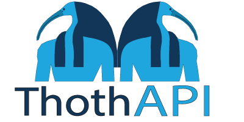

 
 

 
 

### Continuous Integration (CI)

|Project|Branch|Action|
|:------|:----:|:-----|
|[Gateways/Gateway.YARP](https://github.com/sergej-stk/Thoth-API/tree/main/src/Gateways/Gateway.YARP)|[main](https://github.com/sergej-stk/Thoth-API)||
|[Services/Users/User.API](https://github.com/sergej-stk/Thoth-API/tree/main/src/Services/Users/User.API)|[main](https://github.com/sergej-stk/Thoth-API)||

### Author
- [sergej-stk](https://github.com/sergej-stk/)